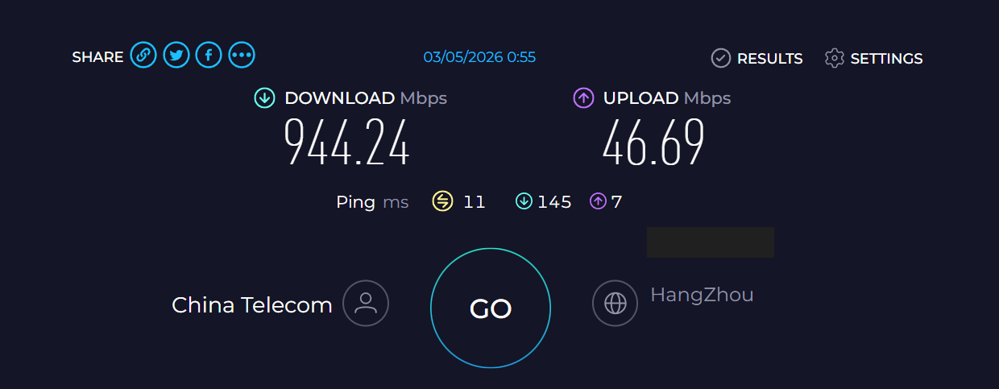

## 引言

寒假回家研究了一下家里的网络，惊奇地发现网络环境其实真的不错，完全可以好好地利用一下。

由于篇幅太长，我把软件部分单独写了一篇文章：[软件篇](./home-networking-journey-software.md)。这一篇就简单记录一下网络层面的改造过程。

## 网络条件

家里买的是电信的千兆套餐，实测下行千兆左右，上行应该是50兆左右。



而且有动态的公网IPv4和IPv6(/60 前缀)! 这点也是随时随地可以访问家里服务器的前提。(如果没有公网ip的话可以打找客服问问试试，也许能申请到) 虽然说会ban掉80和443端口，但其它端口可以直接访问，还是很香的。

## 之前的一些尝试

其实自初中(2020年左右) 开始，我就开始试着整家庭组网了。当时我们几个同学集资买了两块 500G 的西数黑盘，装在我家一台改了 Windows Server 的旧电脑上整 NAS(网盘)，用来存各种杂物。

> 当时觉得 Linux 太高深了就没学，现在真香了。

高中学校搭了一个 ftp 服务器提供给老师用来存资料。我们看到了就`欸我草这个nb`，于是也给原先的 NAS 整了个ftp。

以前的自己特别喜欢手搓。我们当时的ftp服务就是用Python的pyftpdlib库写的(因为那玩意对utf-8支持不好还改了源码)。WebUI则是三件套写的原生前端与从Python socket库开始手搓的后端，也算是Web开发入门了。

> ftp 应该早就被 WebDAV 爆金币了。现在看看像原始人从石头开始搭小屋一样，没被黑客打下来算我运气好的。

依稀记得当时 tp-link 路由器还有 DDNS 功能(`tpddns.cn`，现在已经不提供服务了)，我们就直接用这个域名访问 ftp 服务器。后来还为了域名好看点还买了一年花生壳的域名来做 DDNS，有点冤大头了。

不过现在这套用着超级爽的方案，也算是圆了当时的梦了。

## 改造方案

结论先行，先上最后的拓扑图。


### 光猫

我们的上网方式是光纤入户，然后光猫进行光电转换，拨号上网与路由。墙里埋好的网线连着光猫的三个 LAN 口和家里在客厅、主卧和书房的三个网口，书房的网口连着一台开着路由模式的ZXHN E1630。

但是我发现光猫的固件自由度太低了，用着实在憋屈。最后是直接Call了一下`10000`把光猫改成了桥接模式，只用它当做一个调制解调器；拨号与路由就交给下面这台路由器了。网线则是从光猫的 LAN 口拔了下来，插到路由器的 LAN 口上去了。E1630则是改成了有线中继模式。

### CMCC RAX3000M EMMC 路由器

> 3000M是指所有设备通过无线连接到它时的总带宽，而不是网口的带宽。这个路由器的网口是千兆的，所以实际的有线连接速度只能达到千兆。无线连接的话，可能在理想条件下能达到3000M，但是实际使用中很难达到这个速度。

买这个路由器主要是为了图省事(小黄鱼老哥帮忙刷了OpenWRT)，而且正好有三个LAN口可以接家里的网线，但到手之后发现系统是KWrt，虽然是懒人式的，但有些臃肿。上网去找其他改版的固件，发现竟然只有KWrt有现成的EMMC版本固件，其他固件都要自己编译，就望而却步了。(抛去臃肿不谈，KWrt还是挺好用的)

> 然后被我妈吐槽家里的wifi太多了。

如果没有无线需求的话，也许还是直接上x86的双网口软路由(比如J1900) 加一台小交换机更好(笑)。

#### 上网方式

光猫改成中继后，拨号上网的重任就交给了这台主路由。路由器的WAN口连接到光猫的LAN口，设置好PPPoE拨号账号密码后就可以上网了。

这样，路由器可以直接拿到电信分配的公网IPV4地址以及IPV6前缀，对后续的服务器访问和端口转发都非常友好。

#### DDNS

我把域名挂在了Cloudflare上，使用了他们的API来更新DNS记录。路由器上则是安装了`ddns-scripts` 和 `luci-app-ddns`。[自用的DDNS脚本](https://github.com/Cromemadnd/update_cloudflare.sh)

#### 防火墙配置（端口转发 / 通信规则）

端口转发用于把外部访问特定端口的IPV4请求转发到服务器上，通信规则则用于允许直连服务器或路由器的特定端口。


### 服务器

说是服务器，其实是初中时候自己配的第一台台式机，在当时应该算是中等配置。

硬件也是东拼西凑整起来的，如下。

```bash
System:
  Kernel: 6.8.0-101-generic x86_64 bits: 64 compiler: N/A Console: pty pts/2
    Distro: Ubuntu 22.04.5 LTS (Jammy Jellyfish)
Machine:
  Type: Desktop Mobo: ASUSTeK model: TUF B450M-PLUS GAMING v: Rev X.0x serial: <filter>
    UEFI: American Megatrends v: 4622 date: 09/29/2024
CPU:
  Info: 6-core model: AMD Ryzen 5 3500X bits: 64 type: MCP arch: Zen 2 rev: 0 cache: L1: 384 KiB
    L2: 3 MiB L3: 32 MiB
  Speed (MHz): avg: 2200 min/max: 2200/4120 boost: enabled cores: 1: 2200 2: 2200 3: 2200
    4: 2200 5: 2200 6: 2200 bogomips: 43119
  Flags: avx avx2 ht lm nx pae sse sse2 sse3 sse4_1 sse4_2 sse4a ssse3
Graphics:
  Device-1: NVIDIA GM206 [GeForce GTX 960] vendor: ZOTAC driver: nvidia v: 535.288.01
    bus-ID: 07:00.0
  Display: server: X.org v: 1.21.1.4 with: Xwayland v: 22.1.1 driver: X: loaded: nvidia
    unloaded: fbdev,modesetting,nouveau,vesa gpu: nvidia tty: 121x41
  Message: GL data unavailable in console for root.
Drives:
  Local Storage: total: 1.5 TiB used: 258.2 GiB (16.9%)
  ID-1: /dev/nvme0n1 vendor: Lexar model: 1TB SSD size: 953.87 GiB temp: 40.9 C
  ID-2: /dev/sda vendor: SanDisk model: SD8SBBU120G1122 size: 111.79 GiB
  ID-3: /dev/sdb vendor: Western Digital model: WD5003ABYZ-011FA0 WDC-ROM SN# size: 465.76 GiB
```

