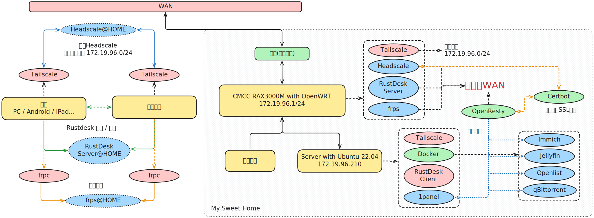

## 引言

这一篇文章大概记录一下软件层面的配置过程，也是个人对 NAS 与服务器常用软件的一篇安利。

可以先看看[网络篇](./home-networking-journey-network.md)来了解一下网络环境和改造方案。

## 改造方案

这次的拓扑图主要是展示软件层面的配置。

### CMCC RAX3000M EMMC 路由器

#### Headscale

#### Tailscale

#### RustDesk Server

#### frps

### 服务器

说是服务器，其实是初中时候自己配的第一台台式机，在当时应该算是中等配置。

